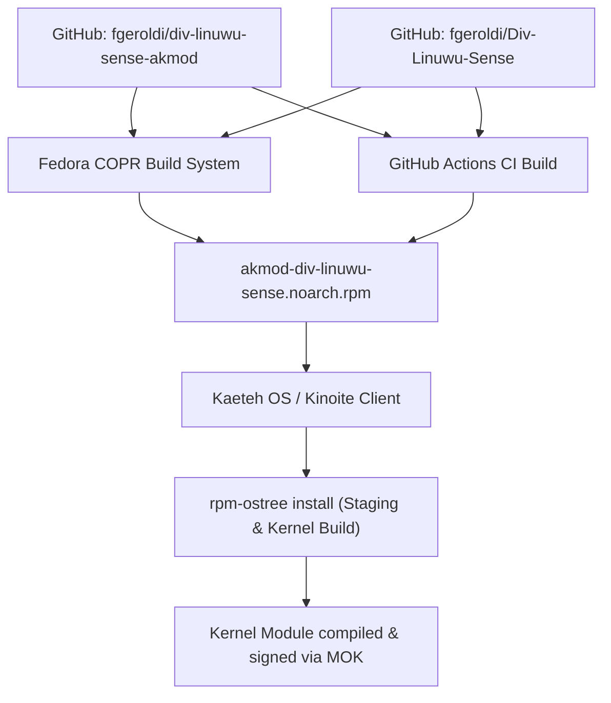

# Implementation Plan: Div-Linuwu-Sense Akmod for Immutable Linux

## 1. Overview

This project provides an automated **Akmod package** for the [Div-Linuwu-Sense](https://github.com/fgeroldi/Div-Linuwu-Sense) kernel module. It is designed to be layered cleanly onto **Kaeteh OS** (and Fedora Kinoite / Silverblue) using `rpm-ostree`, ensuring the module recompiles automatically on kernel updates while respecting the read-only root filesystem.

---

## 2. Packaging Architecture



---

## 3. GitHub Management via GitHub CLI (`gh`)

To version and manage the `div-linuwu-sense-akmod` package repository using the **GitHub CLI (`gh`)**:

```bash
# 1. Verify GitHub CLI authentication status
gh auth status

# 2. Enter project directory
cd /home/fgeroldi/div-linuwu-sense-akmod

# 3. Initialize git repository if not initialized
git init -b main

# 4. Stage and commit
git add .
git commit -m "feat: initial spec, CI and build scripts for div-linuwu-sense akmod"

# 5. Create remote repository and push in a single command using GitHub CLI
gh repo create div-linuwu-sense-akmod --public --source=. --remote=origin --push

# 6. Verify repository status
gh repo view
```

---

## 4. Publication via Fedora COPR (Recommended)

Fedora COPR builds the package in the cloud for Fedora 41 (x86_64) automatically on every GitHub commit.

### Setup Steps:
1. Log in to [Fedora COPR](https://copr.fedorainfracloud.org/) using your Fedora Account or GitHub.
2. Click **New Project**:
   * **Project Name:** `div-linuwu-sense`
   * **Instructions:** "Akmod driver for Acer Nitro & Predator fan and RGB control"
   * **Chroots:** Check `fedora-41-x86_64` (and `fedora-rawhide-x86_64` if desired).
3. Under **Packages**, add a new package:
   * **Package Name:** `akmod-div-linuwu-sense`
   * **Source Type:** Custom / Git or SCM.
   * **Clone URL:** `https://github.com/fgeroldi/div-linuwu-sense-akmod`
   * **Spec File Path:** `div-linuwu-sense.spec`
4. Enable the **GitHub Webhook** so new pushes trigger builds automatically.

---

## 5. Local Build Alternative (Without COPR)

If you prefer building the `.rpm` locally (e.g. inside a Fedora container or toolbox):

```bash
# 1. Install build tools
sudo dnf install -y rpmdevtools rpmlint kmodtool akmods gcc make systemd-rpm-macros elfutils-libelf-devel

# 2. Download the source tarball
spectool -g -R div-linuwu-sense.spec

# 3. Build the akmod and common packages
rpmbuild -ba --define "buildforkernels akmod" div-linuwu-sense.spec

# The resulting RPMs will be in:
# ~/rpmbuild/RPMS/noarch/akmod-div-linuwu-sense-*.noarch.rpm
# ~/rpmbuild/RPMS/noarch/div-linuwu-sense-common-*.noarch.rpm
```

---

## 6. Installing on Kaeteh OS

Once the RPM is generated (either via COPR or local file / GitHub Actions Artifacts):

### If using COPR:
```bash
# 1. Enable the COPR repository
sudo curl -o /etc/yum.repos.d/_copr:fgeroldi:div-linuwu-sense.repo \
  https://copr.fedorainfracloud.org/coprs/fgeroldi/div-linuwu-sense/repo/fedora-41/fgeroldi-div-linuwu-sense-fedora-41.repo

# 2. Layer the package with rpm-ostree
rpm-ostree install akmod-div-linuwu-sense

# 3. Reboot into the new deployment
systemctl reboot
```

### If using a local RPM or GitHub Actions Artifact:
```bash
rpm-ostree install ./akmod-div-linuwu-sense-1.0.0-1.fc41.noarch.rpm ./div-linuwu-sense-common-1.0.0-1.fc41.noarch.rpm
systemctl reboot
```

---

## 7. Secure Boot Verification

Kaeteh OS has been pre-configured to stage the MOK key automatically.
* When the computer reboots after installing the akmod, Shim will present the blue **MOK Management** screen (if not previously enrolled).
* Select: **Enroll MOK** -> **Continue** -> **Confirm** -> Enter password: `kaeteh`.
* Verify that the module and services loaded:
  ```bash
  lsmod | grep linuwu_sense
  systemctl status linuwu_sense
  ```
